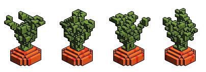

= VoxelFarm - Assets
:icons: font
:icon-set: fa
:source-highlighter: rouge
:experimental:
ifdef::env-github[]
:tip-caption: :bulb:
:note-caption: :information_source:
:important-caption: :heavy_exclamation_mark:
:caution-caption: :fire:
:warning-caption: :warning:
endif::[]

=== Pflanzen

